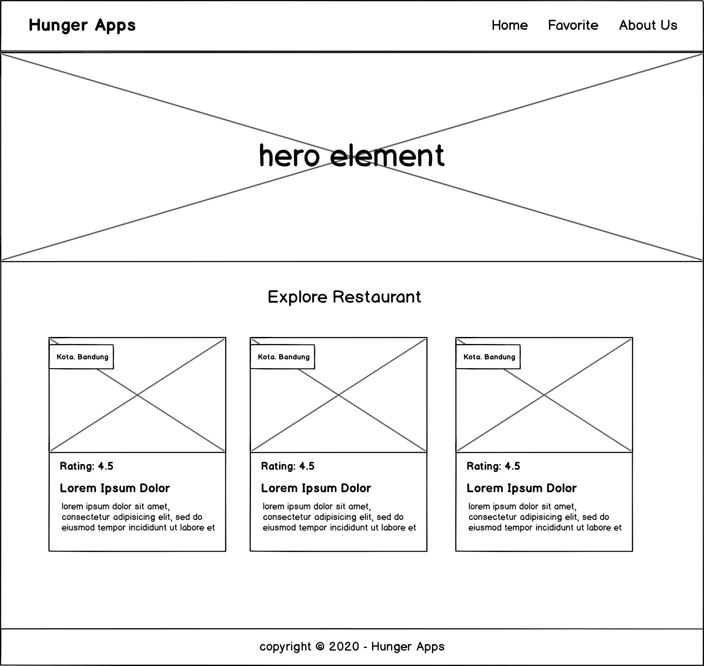

Fitur yang harus ada pada aplikasi:

1.  **App Bar (Navigation Bar)**  
    Syarat:
    -   Menampilkan nama aplikasi atau brand logo dari aplikasi katalog restoran (tentukan sendiri nama aplikasi atau brand logonya).
    -   Terdapat navigation menu:
        -   Home → mengarah ke root domain.
        -   Favorite → target URL cukup bernilai “#” (Sebagai placeholder untuk digunakan pada submission selanjutnya).
        -   About Us → arahkan ke profil LinkedIn/Github/Social Media Anda, atau boleh juga ke personal web/blog.
    -   Terdapat fitur navigation drawer yang berfungsi dengan baik bila diakses pada layar seluler.  
          
        
2.  **Hero Element (Jumbotron Element)  
    **Syarat:
    -   Menampilkan hero element dengan gambar yang sudah ditentukan, silakan pilih salah satu aset yang disediakan di dalam starter proyek,  _src → public → images → hero_. Gambar yang tidak digunakan, bisa Anda hapus.
    -   Gambar hero element yang ditampilkan haruslah  _full-width_ atau memenuhi persyaratan sebagai berikut.
        -   Tampilkan minimal dengan width 1000px pada ukuran viewport width >= 1200px.
        -   Jika ukuran viewport width < 1200px, hero element ditampilkan  _full-width._  
              
            
3.  **Daftar Restoran**  
    Syarat:
    -   Menampilkan daftar restoran berdasarkan data yang sudah disediakan di dalam project starter–lokasinya ada di src → public → data → DATA.json. Untuk menampilkannya dapat melalui cara hardcoded–dituliskan dalam HTML secara langsung–atau DOM manipulation menggunakan JavaScript.
    -   Wajib menampilkan nama, gambar, dan minimal salah satu di antara kota, rating, dan/atau deskripsi pada restoran.  
          
        
4.  **Footer**  
    Syarat:
    -   Terdapat footer yang ditampilkan di bawah halaman.
    -   Terdapat konten teks bebas sesuai dengan kreatifitas Anda. Misalnya, konten hak cipta yang mencangkup tahun dan nama aplikasi. Contoh: “Copyright © 2020 - Hunger Apps”.  
          
        
5.  **Responsibilitas Tampilan**  
    Syarat:
    -   Tampilan web app harus responsif pada seluruh ukuran layar (mobile - tablet - desktop). Utamakan tampilan mobile terlebih dahulu.
    -   Gunakan teknik Grid CSS atau Flexbox dalam menyusun layout. Bila terdapat float, submission Anda akan kami ditolak.
    -   Menetapkan ukuran viewport secara dinamis berdasarkan layar device yang digunakan.  
          
        
6.  **Aksesibilitas Website**  
    Syarat:
    -   Seluruh fungsionalitas website dapat dilakukan dengan menggunakan keyboard. Contohnya mengakses tombol hamburger button, mengakses tautan yang ada, dan lain sebagainya.
    -   Menerapkan teknik  _Skip to Content_  untuk melewati focus pada menu navigasi.
    -   Terdapat alternative teks pada seluruh gambar yang ditampilkan. Bila ada gambar yang tidak memiliki arti apa pun, cukup berikan atribut  **alt**  dengan nilai kosong.
    -   Dimensi  _touch target_  pada elemen yang diinteraksikan dengan  _touch_ harus memilliki ukuran elemen minimal 44x44px. Adapun beberapa contoh elemen tersebut meliputi button, anchor, input text, dan textarea.  
        Pastikan juga terdapat jarak antar elemen tersebut supaya dimensi  _touch target_  tidak menumpuk.
    -   Menggunakan  _semantic element_  dalam menyusun struktur dan landmarking HTML.

**Perhatian**:

-   Dalam mengerjakan submission ini,  _Anda tidak diperkenankan_ menggunakan css framework (seperti Bootstrap, Materialize, Tailwind, dll) yang dapat membantu dalam menyusun tampilan yang responsif. Tuliskan kode CSS from scratch, sistem layouting CSS murni saat ini sudah cukup powerful untuk membuat tampilan website responsif.

Berikut kerangka tampilan yang bisa Anda gunakan sebagai referensi.

