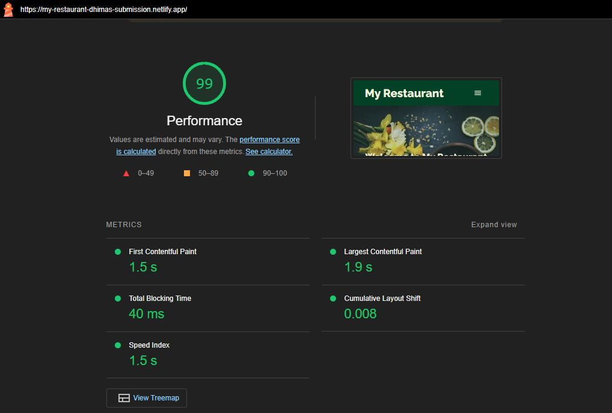

Semua saran yang diharapkan terpenuhi :

- Menuliskan test case secara lengkap:
	- model contracts
	- render loading button sebelum / sesudah get data

- Menerapkan End to End test pada skenario lain di luar yang sudah ditentukan :
	- post review restaurant
	- post review tanpa mengisi form
- Menerapkan optimasi lain di luar dari optimasi yang menjadi persyaratan:
	- placeholder svg image pada ketika lazyload
	- minimize css
	- compress menggunakan algoritma gzip

- Mendeploy hasil web app yang Anda kerjakan ke _third-party hosting. Serta, memperhatikan metrik Web Vitals dengan nilai:

	-  **FCP** < 2.5 detik

	-  **FID**/**TBT** < 100 ms

	-  **CLS** < 0.1

Hasil deployment aplikasi di [netlify](https://my-restaurant-dhimas-submission.netlify.app/) dengan web vitals score

